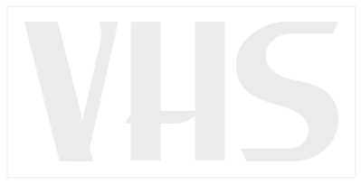
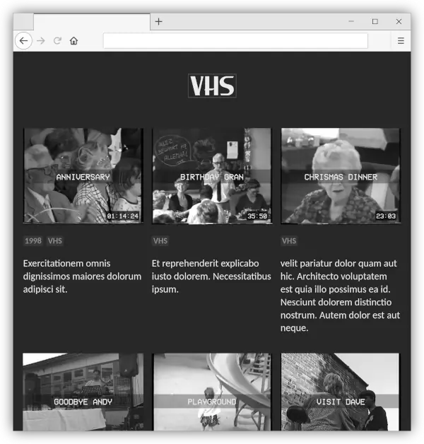

  
  
<em>VHS is a personal, private, family “YouTube” mini-website.</em>

  

## Why

This mini-website is a digital video archive of our old [VHS](https://en.wikipedia.org/wiki/VHS) & [Hi8](https://en.wikipedia.org/wiki/8_mm_video_format) family cassettes that were collecting dust in the attic. Magnetic tape decays or molds, cassettes get lost. A digital format can easily be shared or viewed and is easier to backup.

Read the [blog post](https://www.suffix.be/blog/family-youtube/) with the full story.

## How

The videos and cover images are stored in a [Backblaze B2](https://www.backblaze.com/b2/cloud-storage.html) bucket (free up to 10GB). The [`casettes.json`](cassettes.json) file contains the metadata for each video (filename, title, length, …). A weekly cron job generates [signed URLs](https://www.suffix.be/blog/signed-urls-backblaze-b2/) for the video files, cover images and adds updates to the [`cassettes.json`](cassettes.json) file. A simple HTML page loads the JSON via JavaScript web components and shows a retro-style cover image with the link to the video. Authentication is handled with the standard Apache `.htpasswd` system (not included).

## Installation

Installation should be simple, the only dependency is the Backblaze B2 [command line tool](https://www.backblaze.com/b2/docs/quick_command_line.html) and Python (pre-installed on most Linux systems) to run the [generate](generate) script.

1. Authenticate B2 with an applicationKey and upload your videos and cover images. The key used for the [generate](generate) script only needs read access.
2. Copy the repository to your webserver’s document root and edit [`cassettes.json`](cassettes.json) as needed.
3. Run the [generate](generate) Python script and pass it the path the the `cassetes.json` your Backblaze B2 bucket name: `./generate cassettes.json my-video-bucket`. This will generate a signed URL valid for one week for each of the videos and cover images.
4. Test the webpage, the images should load and clicking an image will start the video. The webpage copy is in Dutch but can easily be changed as needed.
5. Add a cronjob to run the [generate](generate) script each week to refresh the video and cover images URLs.

### Cover image

Cover image can be created offline (the generated script does not create cover images). I used [ffmpeg](https://ffmpeg.org/).

    ffmpeg -ss 00:00:10.00 -i path/to/video.mp4 -y -f image2 -vcodec mjpeg -vframes 1 path/to/cover.jpg

### VCR OSD Mono Font (optional)

The screenshot uses the retro [VCR OSD Mono](https://www.dafont.com/vcr-osd-mono.font) font by Riciery Leal for the text over the cover images. The font is free for personal and commercial use but I am not sure it can be freely redistributed so it’s not included in this repository. You can [download](https://www.dafont.com/vcr-osd-mono.font) and extract the font and place it in the `/fonts` folder.

## Development

The whole thing is a static website really but since it loads the videos from a JSON config file a local webserver is needed to view the result. This Python one-liner is probably the easiest way to get started. Next, open http://0.0.0.0:8080/ in your browser.

    python -m http.server 8080

The local copy can easily be pushed to the webserver via `rsync` (or any other way you prefer).

    rsync --recursive --compress --delete --delete-excluded --exclude 'readme.md' -e ssh . USER@HOST:/var/www/vhs
